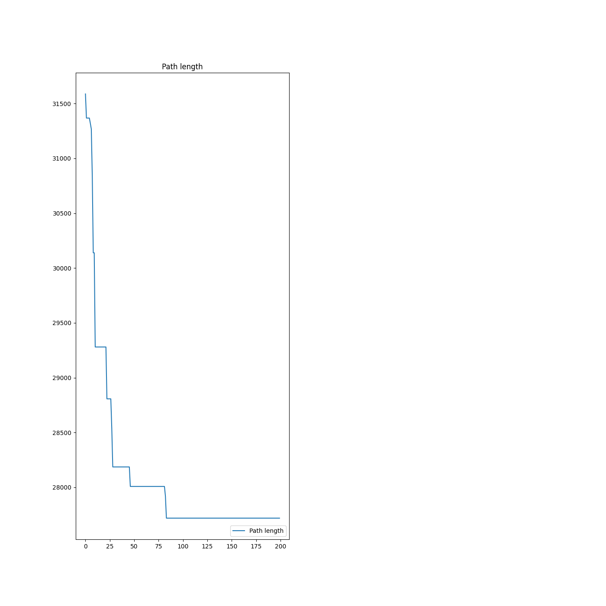
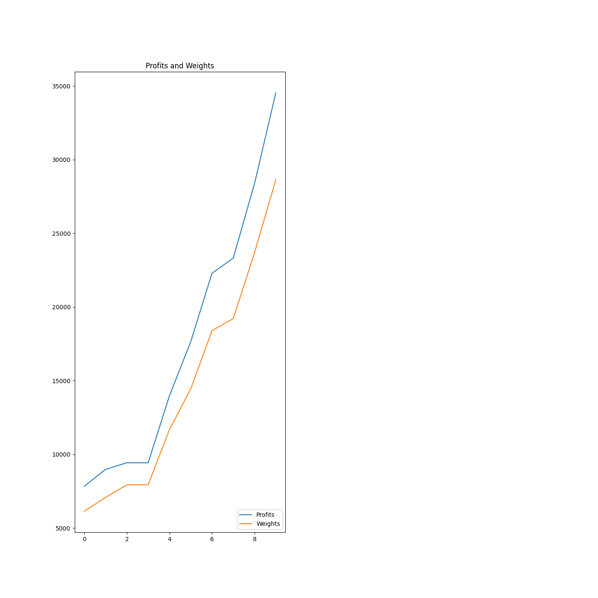

# travelling-thief-problem
Nature Inspired Algorithim course: Solving Bi-objective Traveling Thief Competition using Genetic Algorithim.

Please have a look at the competition outline [Here](https://www.egr.msu.edu/coinlab/blankjul/gecco19-thief/)

## Code and Resources Used 
**Python Version:** 3.7  
**Packages:** Numpy, matplotlib
## Introduction
* The Traveling Thief Problem (TTP) is an optimization problem that combines two classic problems: the Traveling Salesman   Problem (TSP) and the Knapsack Problem. In the TTP, there is a thief who can move between cities and steal items with the goal of maximizing their total profit while considering both time and space constraints.

## Objective:
The objective of the Traveling Thief Problem is to find the optimal route for the thief to travel between cities, deciding which items to steal at each city, in a way that maximizes the total profit while considering the combined constraints of time and knapsack capacity.

## Components of the TTP:
### Cities: 
Similar to the TSP, the thief has to visit a set of cities, each with its coordinates.

### Items:
Each city contains a set of items with varying weights, profits, and a single copy of each item.

### Knapsack Capacity:
The thief has a limited carrying capacity (the knapsack) to carry stolen items.

### Time Constraints:

There's a time constraint associated with each city visit. The longer the thief stays in a city, the more profit they can accumulate from stealing items, but it also incurs higher travel costs.

## Genetic Algorithim Implementation Flow Chart

## Challenges:
### Trade-off between Time and Profit: 
Optimal routes that allow more time for item collection might increase travel costs.
### Knapsack Limitation: 
Balancing the items stolen within the capacity constraint.
### Complexity: 
The problem is NP-hard due to the combination of the TSP and Knapsack Problem.

## Results and Visualization

